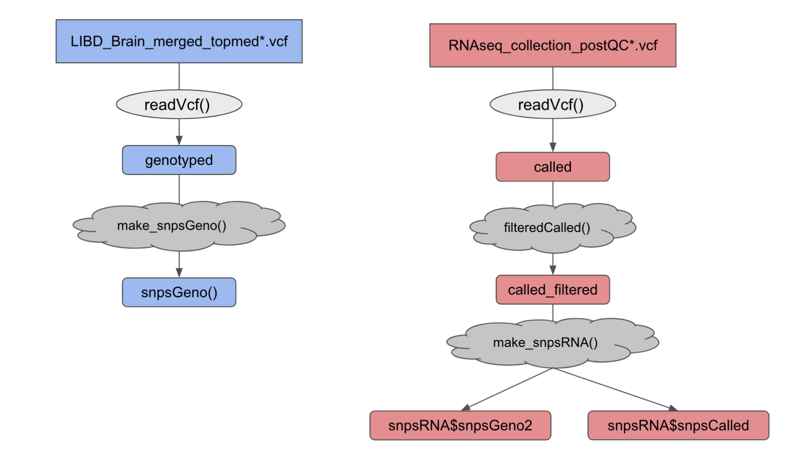
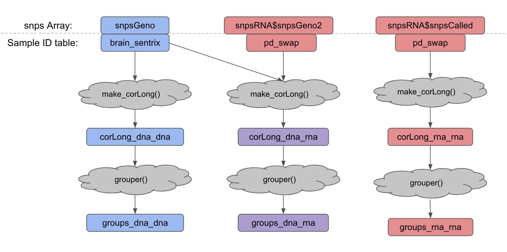

<!-- README.md is generated from README.Rmd. Please edit that file -->

```{r, include = FALSE}
knitr::opts_chunk$set(
    collapse = TRUE,
    comment = "#>",
    fig.path = "man/figures/README-",
    out.width = "100%"
)
```

# brainstorm

<!-- badges: start -->
[](https://codecov.io/gh/LieberInstitute/brainstorm?branch=master)
[](https://github.com/LieberInstitute/brainstorm/actions)
<!-- badges: end -->

The goal of `brainstorm` is to match genotype and RNA-seq data to conform IDs of brain samples.

## Installation instructions

Get the latest stable `R` release from [CRAN](http://cran.r-project.org/). Then install `brainstorm` using from [Bioconductor](http://bioconductor.org/) the following code:

```{r 'install', eval = FALSE}
if (!requireNamespace("BiocManager", quietly = TRUE)) {
    install.packages("BiocManager")
}

BiocManager::install("brainstorm")
```

And the development version from [GitHub](https://github.com/) with:

```{r 'install_dev', eval = FALSE}
BiocManager::install("joshstolz/brainstorm")
```

## Workflow 
### Step 1. Prepare the snp Data  
  
### Step 2. Correlate the Data and Identify Groups 
    
### Step 3. Identify and Resolve Swaps
Coming Soon...

## Example

### TBD...

```{r example, eval = requireNamespace('brainstorm')}
library("brainstorm")
## basic example code
```

## Citation

Below is the citation output from using `citation('brainstorm')` in R. Please
run this yourself to check for any updates on how to cite __brainstorm__.

```{r 'citation', eval = requireNamespace('brainstorm')}
print(citation("brainstorm"), bibtex = TRUE)
```

Please note that the `brainstorm` was only made possible thanks to many other R and bioinformatics software authors, which are cited either in the vignettes and/or the paper(s) describing this package.

## Code of Conduct

Please note that the `brainstorm` project is released with a [Contributor Code of Conduct](https://contributor-covenant.org/version/2/0/CODE_OF_CONDUCT.html). By contributing to this project, you agree to abide by its terms.

## Development tools

* Continuous code testing is possible thanks to [GitHub actions](https://www.tidyverse.org/blog/2020/04/usethis-1-6-0/)  through `r BiocStyle::CRANpkg('usethis')`, `r BiocStyle::CRANpkg('remotes')`, and `r BiocStyle::CRANpkg('rcmdcheck')` customized to use [Bioconductor's docker containers](https://www.bioconductor.org/help/docker/) and `r BiocStyle::Biocpkg('BiocCheck')`.
* Code coverage assessment is possible thanks to [codecov](https://codecov.io/gh) and `r BiocStyle::CRANpkg('covr')`.
* The [documentation website](http://.github.io/brainstorm) is automatically updated thanks to `r BiocStyle::CRANpkg('pkgdown')`.
* The code is styled automatically thanks to `r BiocStyle::CRANpkg('styler')`.
* The documentation is formatted thanks to `r BiocStyle::CRANpkg('devtools')` and `r BiocStyle::CRANpkg('roxygen2')`.

For more details, check the `dev` directory.

This package was developed using `r BiocStyle::Biocpkg('biocthis')`.


